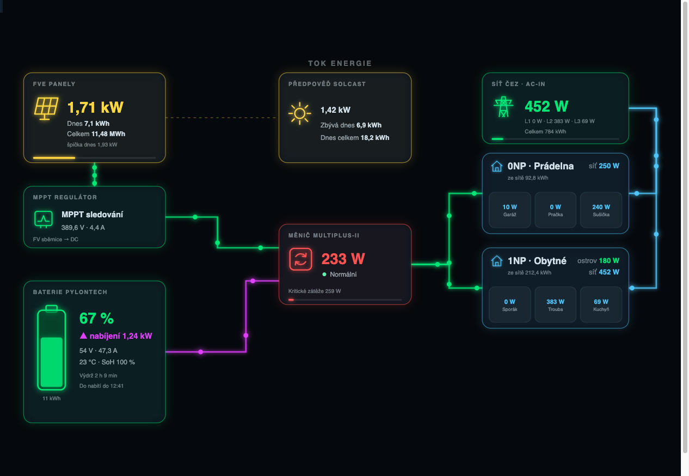

# FVE Flow Card

Custom Lovelace karta pro Home Assistant — animovaný diagram toků energie na míru
**ostrovní FVE (Victron)** + **grid po patrech (Shelly)**, se Solcast predikcí.



- Ostrovní větev: FVE panely → MPPT → baterie Pylontech ↔ MultiPlus-II → patra
- Gridová větev: AC-IN (Shelly) → patra, každé patro s pojmenovanými fázemi
  (L1 = Pračka, L2 = Sušička, ...)
- Světelné pulzy po vodičích — rychlost úměrná výkonu, směr podle znaménka,
  mrtvá linka pod prahem zešedne
- Klik na uzel / fázi otevře nativní HA more-info dialog s historií entity
- Plně konfigurovatelná přes GUI editor (entity pickery, dynamický seznam pater)
- Responzivní SVG scéna — ideální pro fullscreen `panel` view

## Předpoklady a závislosti

Karta sama nemá žádné JS závislosti (vše je zabundlované), ale počítá s tím,
že v Home Assistantu existují entity z těchto integrací:

| Komponenta | Integrace | Co dodává |
| --- | --- | --- |
| **Victron** (Cerbo GX / Venus OS, MultiPlus-II, SmartSolar MPPT, Pylontech) | např. [victron-hacs](https://github.com/sfstar/hass-victron) nebo MQTT z Venus OS | výkon FVE, stav MPPT, SoC/výkon baterie, výkon a stav měniče, kritické zátěže |
| **Shelly** (3EM / Pro 3EM na AC-IN a patrech) | nativní [Shelly integrace](https://www.home-assistant.io/integrations/shelly/) | příkon ze sítě celkem + po fázích, energie a výkony jednotlivých pater |
| **Solcast** | [Solcast PV Forecast](https://github.com/BJReplay/ha-solcast-solar) (HACS) | predikce výkonu a denní výroby |

Konkrétní entity se vybírají v GUI editoru — karta není závislá na přesných
názvech, funguje s čímkoli, co vrací čísla ve W / kWh / %.

## Instalace

### HACS (doporučeno)

1. HACS → tři tečky vpravo nahoře → **Custom repositories**
2. Vlož URL tohoto repozitáře, kategorie **Dashboard** (Lovelace)
3. Nainstaluj **FVE Flow Card** a reloadni prohlížeč

HACS řeší registraci resource i cache-busting automaticky; updaty se nabízejí
z GitHub releases.

### Ručně

1. Stáhni `fve-flow-card.js` z posledního [release](../../releases)
2. Zkopíruj do `/config/www/`
3. Nastavení → Dashboardy → ⋮ → Zdroje → Přidat:
   URL `/local/fve-flow-card.js?v=0.1.0`, typ **JavaScript module**

## Konfigurace

Kartu přidáš přes výběr karet (**FVE Flow Card**) a nakonfiguruješ v GUI editoru.
Ekvivalentní YAML:

```yaml
type: custom:fve-flow-card
title: Tok energie
pv:
  power: sensor.mppt_vykon_fotovoltaiky        # povinné
  energy_today: sensor.mppt_vynos_dnes
  energy_total: sensor.mppt_celkovy_vynos
  max_power_today: sensor.mppt_max_vykon_dnes
  voltage: sensor.mppt_napeti_fv
  current: sensor.mppt_proud_dc
  mppt_state: sensor.mppt_rezim
  name: FVE panely                             # vlastní název panelu
  mppt_name: MPPT regulátor                    # vlastní název MPPT uzlu
battery:
  soc: sensor.baterie_nabijeni                 # povinné pro zobrazení baterie
  power: sensor.baterie_vykon                  # kladné = nabíjení (Victron)
  voltage: sensor.baterie_napeti
  current: sensor.baterie_proud
  temperature: sensor.baterie_teplota
  soh: sensor.baterie_zdravi
  runtime: sensor.baterie_odhadovana_vydrz
  cycles: sensor.fve_baterie_pocet_cyklu
  time_to_full: sensor.baterie_doba_do_nabiti
  capacity: sensor.baterie_kapacita
  invert: false                                # true = kladné znamená vybíjení
  name: Baterie Pylontech                      # vlastní název baterie
inverter:
  power: sensor.multiplus_vystupni_vykon
  state: sensor.multiplus_stav
  voltage: sensor.multiplus_vystupni_napeti
  current: sensor.multiplus_vystupni_proud
  load_power: sensor.gx_kriticke_zateze        # celková ostrovní spotřeba
  total_yield: sensor.mppt_celkovy_vynos       # informační řádek (kWh)
  days_in_service: sensor.fve_pocet_dni        # informační řádek
  name: MultiPlus-II
grid:
  power: sensor.grid_ac_in_vykon               # když chybí, sečtou se patra
  phase_a: sensor.grid_ac_in_l1
  phase_b: sensor.grid_ac_in_l2
  phase_c: sensor.grid_ac_in_l3
  energy_total: sensor.grid_ac_in_energie
  name: Síť ČEZ
solcast:
  power_now: sensor.solcast_power_now
  remaining_today: sensor.solcast_remaining_today
  total_today: sensor.solcast_forecast_today
floors:
  - name: 0NP
    grid_power: sensor.0np_grid_ac_out_vykon   # nepovinné, jinak součet fází
    grid_energy: sensor.0np_grid_ac_out_energie
    island_power: sensor.0np_fve_ac_out_vykon  # výkon z FVE — budoucí Shelly
    phase_a_entity: sensor.0np_grid_ac_out_l1
    phase_a_name: Pračka                       # vlastní název zásuvky/spotřebiče
    phase_a_icon: mdi:washing-machine
    phase_b_entity: sensor.0np_grid_ac_out_l2
    phase_b_name: Sušička
    phase_b_icon: mdi:tumble-dryer
    phase_c_entity: sensor.0np_grid_ac_out_l3
    phase_c_name: Sporák
    phase_c_icon: mdi:stove
options:
  max_flow_w: 5000      # výkon pro plnou rychlost animace
  deadband_w: 25        # pod tímto výkonem je linka „mrtvá"
  dots: 3               # počet světelných teček na lince
  min_duration: 1.4     # nejrychlejší oběh (s)
  max_duration: 6       # nejpomalejší oběh (s)
  animation: true
```

### Barevné prahy (semafor)

Uzly FVE, baterie, měnič a grid podporují konfigurovatelné prahy — barva se
promítne do rámu uzlu, hlavní hodnoty a progress baru na spodku:

```yaml
pv:
  power: sensor.mppt_vykon
  yellow_from: 600      # pod 600 W červená
  green_from: 2000      # 600–2000 W žlutá, nad 2000 W zelená
  bar_max: 5000         # rozsah progress baru (default = options.max_flow_w)
battery:
  soc: sensor.baterie_nabijeni
  yellow_from: 15       # default 15 (pod = červená)
  green_from: 40        # default 40 (nad = zelená)
grid:
  power: sensor.grid_vykon
  yellow_from: 1500
  green_from: 2500
  severity_invert: true # vysoký odběr = špatný → obrácené barvy
```

Bez nakonfigurovaných prahů zůstává uzel ve výchozí barvě větve (zelená
ostrov / modrá grid). Baterie má prahy vždy (defaulty 15/40) a barví i ikonu
s fill podle SoC; progress bar u ní nahrazuje samotná ikona baterie.

Poznámky:

- **Patra** jsou dynamický seznam — nové patro (např. 2NP, 1f) přidáš v editoru
  bez zásahu do kódu. Dokud patro nemá `island_power`, ostrovní tok se zobrazuje
  jen souhrnně z měniče a patrové ostrovní číslo je skryté.
- **Fáze bez vlastního názvu** se zobrazí jako L1/L2/L3 s ikonou `mdi:flash`.
- Fullscreen: použij view `type: panel` s jedinou touto kartou
  (ukázka v `lovelace/fve_flow/fve-flow.yaml` v nadřazeném repu konfigurace).

## Vývoj

```bash
npm install
npm run build      # dist/fve-flow-card.js
npm run watch      # rebuild při změně
npm run typecheck
```

Lokální test v HA: zkopíruj `dist/fve-flow-card.js` do `/config/www/`
a registruj resource `/local/fve-flow-card.js?v=dev-1` (číslo zvyšuj kvůli cache).

## Release checklist

1. Zvedni `version` v `package.json` (SemVer)
2. `git commit` + `git tag vX.Y.Z` + `git push --tags`
3. GitHub Actions zbuildí kartu a přiloží `fve-flow-card.js` k release
4. HACS nabídne update automaticky

## Známá omezení

- Karta nezobrazuje vlastní historické grafy — historie je přes klik na
  uzel/fázi (nativní HA more-info dialog).
- Export do gridu se nevizualizuje (ostrovní systém nedodává do sítě).
- Fáze jsou max. 3 na patro (A/B/C dle Shelly 3EM).

## Autor

**[elvisek2020](https://github.com/elvisek2020)** — karta vznikla na míru
vlastní instalaci: ostrovní FVE na Victronu (MultiPlus-II 48/5000, SmartSolar
MPPT, Pylontech) + třífázový grid měřený přes Shelly po patrech. Licence MIT.
