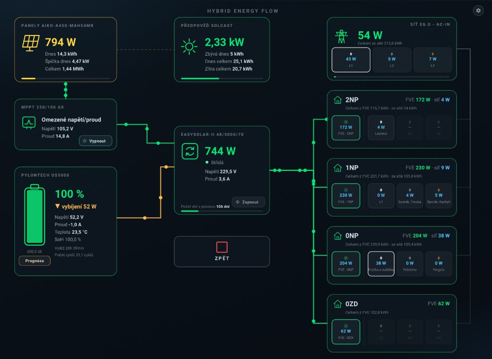
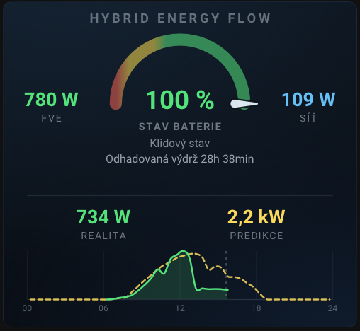

# Hybrid Energy Flow Card

Custom Lovelace karta pro Home Assistant — animovaný diagram toků energie na míru
**hybridní instalaci**: ostrovní FVE (Victron) + grid po patrech (Shelly), se Solcast predikcí.

> Technický typ karty zůstává `custom:fve-flow-card` (a mini `custom:fve-flow-mini-card`),
> aby se nerozbily existující dashboardy. V HACS a výběru karet se zobrazuje nový název.



- Ostrovní větev: FVE panely → MPPT → baterie Pylontech ↔ MultiPlus-II → patra
- Gridová větev: AC-IN (Shelly) → patra, každé patro s pojmenovanými fázemi
  (L1 = Pračka, L2 = Sušička, ...)
- Světelné pulzy po vodičích — rychlost úměrná výkonu, směr podle znaménka,
  mrtvá linka pod prahem zešedne
- Aktivní fáze (> 10 W) mají výraznější okraj chipu barvou fáze / FVE
- Prognóza výdrže baterie — 5 dní historie + 7denní predikce (Solcast − spotřeba)
- Okno **Analýza** (tlačítko pod měničem): tok energie do pater, FVE vs síť,
  výroba vs predikce Solcast s heatmapou po hodinách, DC bilance MPPT ·
  baterie · střídač, baterie vs. spotřeba a zatížení fází pro dimenzování
  měniče — za posledních 24 h / Dnes / Včera / 7 / 14 / 30 / 60 / 90 dní
- Klik na uzel / fázi otevře vlastní průběžný graf za posledních 48 hodin
- Plně konfigurovatelná přes GUI editor (entity pickery, dynamický seznam pater)
- Responzivní SVG scéna — ideální pro fullscreen `panel` view
- Volitelné tlačítko ZPĚT pod měničem a rychlý vstup do editace dashboardu

## Předpoklady a závislosti

Pro vlastní 48hodinové grafy karta používá volitelnou `apexcharts-card`.
Pokud není dostupná, kliknutí bezpečně otevře původní nativní historii HA.
Datové entity dodávají tyto integrace:

| Komponenta | Integrace | Co dodává |
| --- | --- | --- |
| **Victron** (Cerbo GX / Venus OS, MultiPlus-II, SmartSolar MPPT, Pylontech) | např. [victron-hacs](https://github.com/sfstar/hass-victron) nebo MQTT z Venus OS | výkon FVE, stav MPPT, SoC/výkon baterie, výkon a stav měniče, kritické zátěže |
| **Shelly** (3EM / Pro 3EM na AC-IN a patrech) | nativní [Shelly integrace](https://www.home-assistant.io/integrations/shelly/) | příkon ze sítě celkem + po fázích, energie a výkony jednotlivých pater |
| **Solcast** | [Solcast PV Forecast](https://github.com/BJReplay/ha-solcast-solar) (HACS) | predikce výkonu a denní výroby |
| **ApexCharts Card** (doporučeno) | [`apexcharts-card`](https://github.com/RomRider/apexcharts-card) (HACS) | vlastní kontinuální 48h grafy po kliknutí |

Konkrétní entity se vybírají v GUI editoru — karta není závislá na přesných
názvech, funguje s čímkoli, co vrací čísla ve W / kWh / %.

## Instalace

### HACS (doporučeno)

1. HACS → tři tečky vpravo nahoře → **Custom repositories**
2. Vlož URL tohoto repozitáře, kategorie **Dashboard** (Lovelace)
3. Pro vlastní grafy nainstaluj z HACS také **ApexCharts Card**
4. Nainstaluj **Hybrid Energy Flow Card** a reloadni prohlížeč

HACS řeší registraci resource i cache-busting automaticky; updaty se nabízejí
z GitHub releases.

### Ručně

1. Stáhni `fve-flow-card.js` z posledního [release](../../releases)
2. Zkopíruj do `/config/www/`
3. Nastavení → Dashboardy → ⋮ → Zdroje → Přidat:
   URL `/local/fve-flow-card.js?v=<verze>` (např. `?v=0.8.13`), typ **JavaScript module**
   (číslo verze zvyšuj při každé aktualizaci kvůli cache)

## Konfigurace

Kartu přidáš přes výběr karet (**Hybrid Energy Flow Card**) a nakonfiguruješ v GUI editoru.
Nevyplněná čísla v editoru ukazují šedě výchozí hodnotu (např. 5000 W, 25 W)
a přepínače animace / sparklin jsou ve výchozím stavu zapnuté.
Ekvivalentní YAML:

```yaml
type: custom:fve-flow-card
title: Tok energie
pv:
  power: sensor.mppt_vykon_fotovoltaiky        # povinné
  energy_today: sensor.mppt_vynos_dnes
  energy_total: sensor.mppt_celkovy_vynos
  max_power_today: sensor.mppt_max_vykon_dnes
  voltage: sensor.mppt_napeti_fv
  current: sensor.mppt_proud_dc
  mppt_state: sensor.mppt_rezim
  mppt_switch: switch.mppt                     # ovládací tlačítko (s potvrzením)
  name: FVE panely                             # vlastní název panelu
  mppt_name: MPPT regulátor                    # vlastní název MPPT uzlu
battery:
  soc: sensor.baterie_nabijeni                 # povinné pro zobrazení baterie
  power: sensor.baterie_vykon                  # kladné = nabíjení (Victron)
  voltage: sensor.baterie_napeti
  current: sensor.baterie_proud
  temperature: sensor.baterie_teplota
  soh: sensor.baterie_zdravi
  runtime: sensor.baterie_odhadovana_vydrz
  cycles: sensor.fve_baterie_pocet_cyklu
  time_to_full: sensor.baterie_doba_do_nabiti
  capacity: sensor.baterie_kapacita
  invert: false                                # true = kladné znamená vybíjení
  name: Baterie Pylontech                      # vlastní název baterie
inverter:
  power: sensor.multiplus_vystupni_vykon
  state: sensor.multiplus_stav
  voltage: sensor.multiplus_vystupni_napeti
  current: sensor.multiplus_vystupni_proud
  load_power: sensor.gx_kriticke_zateze        # celková ostrovní spotřeba (W)
  energy_today: sensor.dum_spotreba_dnes       # „Energie dnes" + LTS historie prognózy (5 dní)
  energy_yesterday: sensor.dum_spotreba_vcera  # model prognózy (Utility Meter last_period)
  days_in_service: sensor.fve_pocet_dni        # informační řádek
  fan_switch: switch.chlazeni_menice           # ovládací tlačítko ventilátoru
  name: MultiPlus-II
grid:
  power: sensor.grid_ac_in_vykon               # když chybí, sečtou se patra
  phase_a: sensor.grid_ac_in_l1
  phase_b: sensor.grid_ac_in_l2
  phase_c: sensor.grid_ac_in_l3
  energy_total: sensor.grid_ac_in_energie
  name: Síť ČEZ
solcast:
  power_now: sensor.solcast_power_now
  remaining_today: sensor.solcast_remaining_today
  total_today: sensor.solcast_forecast_today
  total_tomorrow: sensor.solcast_forecast_tomorrow
  total_day3: sensor.solcast_forecast_day_3   # v Solcast často disabled by default
  total_day4: sensor.solcast_forecast_day_4
  total_day5: sensor.solcast_forecast_day_5
  total_day6: sensor.solcast_forecast_day_6
  total_day7: sensor.solcast_forecast_day_7
forecast:
  min_soc_pct: 10                               # pod tímto SoC = riziko (default 10)
floors:
  - name: 0NP
    grid_power: sensor.0np_grid_ac_out_vykon   # nepovinné, jinak součet fází
    grid_energy: sensor.0np_grid_ac_out_energie
    island_power: sensor.0np_fve_ac_out_vykon  # výkon z FVE na patře
    phase_a_entity: sensor.0np_grid_ac_out_l1
    phase_a_name: Pračka                       # vlastní název zásuvky/spotřebiče
    phase_a_icon: mdi:washing-machine
    phase_b_entity: sensor.0np_grid_ac_out_l2
    phase_b_name: Sušička
    phase_b_icon: mdi:tumble-dryer
    phase_c_entity: sensor.0np_grid_ac_out_l3
    phase_c_name: Sporák
    phase_c_icon: mdi:stove
options:
  max_flow_w: 5000      # výkon pro plnou rychlost animace
  deadband_w: 25        # pod tímto výkonem je linka „mrtvá"
  dots: 3               # počet světelných teček na lince
  min_duration: 1.4     # nejrychlejší oběh (s)
  max_duration: 6       # nejpomalejší oběh (s)
  animation: true
back_button:
  enabled: true
  path: /lovelace/home  # prázdné = výchozí dashboard (/)
analysis:
  enabled: true         # tlačítko Analýza pod ZPĚT (default zapnuto)
  full_soc_pct: 99      # od jakého SoC je baterie „plná" (odhad nevyužité výroby)
```

### Barevné prahy (semafor)

Uzly FVE, baterie, měnič a grid podporují konfigurovatelné prahy — barva se
promítne do rámu uzlu, hlavní hodnoty a progress baru na spodku:

```yaml
pv:
  power: sensor.mppt_vykon
  yellow_from: 600      # pod 600 W červená
  green_from: 2000      # 600–2000 W žlutá, nad 2000 W zelená
  bar_max: 5000         # rozsah progress baru (default = options.max_flow_w)
battery:
  soc: sensor.baterie_nabijeni
  yellow_from: 15       # default 15 (pod = červená)
  green_from: 40        # default 40 (nad = zelená)
grid:
  power: sensor.grid_vykon
  yellow_from: 1500
  green_from: 2500
  severity_invert: true # vysoký odběr = špatný → obrácené barvy
```

Bez nakonfigurovaných prahů zůstává uzel ve výchozí barvě větve (zelená
ostrov / modrá grid). Baterie má prahy vždy (defaulty 15/40) a barví i ikonu
s fill podle SoC; progress bar u ní nahrazuje samotná ikona baterie.

Poznámky:

- **Historie** používá klouzavé okno posledních 48 hodin a pětiminutové průměry.
  Baterie zobrazuje SoC v %, ostatní numerické uzly výkon ve W. Klik na MPPT
  stav zůstává v nativním HA dialogu. Bez ApexCharts se nativní dialog použije
  automaticky jako fallback.
- **Solcast graf** je vystředěný na aktuálním čase: „Skutečnost" je reálný
  výkon FVE (`pv.power`, bez něj historie `solcast.power_now`) za posledních
  24 hodin, „Predikce" je přerušovaná křivka z `detailedForecast` — pokrývá
  celý dnešek od půlnoci i zítřek, takže jde porovnat i uplynulé hodiny.
  Hodnoty Solcastu se převádějí z kW na W.
- **Patra** jsou dynamický seznam — nové patro (např. 2NP, 1f) přidáš v editoru
  bez zásahu do kódu. Dokud patro nemá `island_power`, ostrovní tok se zobrazuje
  jen souhrnně z měniče a patrové ostrovní číslo je skryté.
- **Spoj ze sítě do patra** se kreslí jen u pater s gridovou větví
  (`grid_power` nebo aspoň jedna entita fáze). Patro jen s FVE spoj nemá
  a svislá linka sítě končí u posledního patra, které síť opravdu má.
  Fáze zapnuté jen přes „Zobrazit i bez entity" se za grid nepočítají.
  Bez nakonfigurovaných pater se toky do pater nekreslí vůbec.
- **Rozdělení patra**: pokud má patro `island_power`, box se svislou linkou
  rozdělí na levou FVE zónu a pravou grid zónu; šířky zón odpovídají počtu
  chipů na každé straně (1 FVE + 3 grid = 1:3). Bez FVE zabírají grid fáze
  celou šířku — jednofázové patro tak má jeden chip přes celý box.
  Hodnota FVE chipu je zelená, fáze modré; dlouhé názvy se zkrátí s „…"
  (plný název v tooltipu).
- **Fáze bez vlastního názvu** se zobrazí jako L1/L2/L3 s ikonou `mdi:flash`.
- **Nedostupné entity** (`unavailable` / `unknown`) se zobrazí jako „—" a baterie
  zešedne — nevypadají jako 0 W / 0 %. Mini karta pak gauge vykreslí bez ručičky.
- **Vypnutá animace** (`options.animation: false`) ruší jen pulzující tečky;
  aktivní linky zůstávají barevné.
- **Aktivní chipy**: při |výkon| > 10 W se okraj chipu zvýrazní barvou fáze
  (L1/L2/L3) nebo FVE; pod prahem zůstane tlumený. Platí pro patra i AC-IN.
- **Grid (AC-IN)**: kompaktnější box než dřív; název sítě je malý titulek
  vpravo nahoře (stejný styl jako Solcast), ikona pylónu zůstává velká.
- **Ovládací tlačítka**: `inverter.fan_switch` zobrazí v panelu měniče chip
  Zapnout/Vypnout externí chlazení (přepíná rovnou, běžící ventilátor se točí),
  `pv.mppt_switch` zobrazí v panelu MPPT chip dole (přepnutí s potvrzením).
  Bez nakonfigurované switch entity se tlačítka nevykreslí.
- **Tlačítko nastavení**: ikonka ozubeného kolečka v pravém horním rohu karty
  přepne dashboard přímo do editačního režimu (HA URL param `?edit=1`) —
  ušetří průchod přes postranní menu. U panelového view s jedinou kartou se
  hned nabídne tužka pro úpravu konfigurace.
- **Tlačítko ZPĚT**: volitelné tlačítko pod měničem, případně pod tlačítkem
  Analýza (`back_button.enabled`).
  Cíl nastavíš v `back_button.path` (např. `/lovelace/home`); prázdná cesta
  vede na výchozí dashboard (`/`).
- **Prognóza výdrže baterie**: chip **Prognóza** pod ikonou baterie (jen když
  je vyplněné `inverter.energy_yesterday`, případně legacy
  `forecast.daily_load_entity`) otevře modal:
  - **5 dní naměřené historie** (šedé řádky): výroba z `pv.energy_today`,
    spotřeba z `inverter.energy_today` (denní Utility Meter s LTS). Bez něj
    se historie dopočítá z včerejší entity (`inverter.energy_yesterday`):
    její hodnota během dne X patří dni X−1, včerejšek bere aktuální stav.
    SoC po bilanci u historie = „—“.
  - **7denní predikce**: Solcast (`total_today` / zítra / D3–D7) − včerejší
    spotřeba → SoC po bilanci. Řádek **Dnes** bere celodenní
    `solcast.total_today`, ne `remaining_today` (v noci by zbývalo 0 kWh).
  - SoC po bilanci = očekávaná hladina z denního rozpočtu (kdy výroba dožene
    spotřebu), ne SoC večer.
  - **Poznámka:** SoC po bilanci **není entita** — karta ho **počítá** sama:
    start = aktuální `battery.soc`, každý den
    `SoC += (PV − spotřeba) / capacity × 100` (clamp 0–100 %).
    Z Home Assistant bere jen vstupy (SoC teď, kapacita, Solcast kWh,
    spotřeba), ne predikovaný SoC senzor.
  - Potřebuješ `battery.soc`, `battery.capacity`, včerejší spotřebu u měniče
    a aspoň Solcast dnes/zítra. Pro historickou spotřebu ideálně i
    `inverter.energy_today` s long-term statistics. Dny 3–7 doplň přes
    `solcast.total_day3`…`total_day7` (v Solcast často defaultně vypnuté).
    Práh rizika: `forecast.min_soc_pct` (default 10).
  - Když prognóza nejde otevřít, chip je šedý a důvod (např. „Chybí kapacita
    baterie") je vypsaný přímo pod ním — viditelné i na dotykovém panelu.
  - `battery.capacity` může být v kWh, Wh nebo Ah; Ah se přepočte přes
    `battery.voltage` (bez něj 48 V).
- Fullscreen: použij view `type: panel` s jedinou touto kartou
  (ukázka v `lovelace/fve_flow/fve-flow.yaml` v nadřazeném repu konfigurace).

### Okno Analýza

Tlačítko **ANALÝZA** pod měničem (pod ZPĚT, spodní hranou lícuje s posledním
patrem) otevře přehled za **24 h / Dnes / Včera / 7 / 14 / 30 / 60 / 90 dní** — výchozí je
klouzavých posledních 24 hodin. Karta k tomu nepotřebuje žádné nové entity —
bere ty, které už má, a jejich dlouhodobé statistiky z recorderu HA. Okno
zabírá skoro celou obrazovku (max. 1640 px), dva sloupce karet od šířky tabletu.

U **24 h** se plnění predikce Solcast počítá jen za dnešní část okna
(`detailedForecast` začíná o půlnoci).

- **Zdroje domu** — spotřeba z FVE (výstup měniče) vs. ze sítě, soběstačnost,
  průběh dne (u vícedenních období denní sloupce).
- **Patra** — tokový diagram FVE (měnič) a síť → patra + **Neměřeno**
  (hlavní dodávka − součet pater) a tabulka FVE / síť / celkem / podíl.
  Když patra naměří víc než hlavní měřák, okno upozorní na nesoulad měřáků.
- **FVE a predikce** — skutečná výroba vs. Solcast (`detailedForecast`, p50
  a pásmo p10–p90), plnění predikce, doba s plnou baterií a odhad možné
  nevyužité výroby (predikce − skutečnost v době, kdy SoC ≥ `full_soc_pct`).
  U minulých dní se porovnává s predikcí den předem. Pod grafem **heatmapa
  výroby po hodinách** (sloupce = dny, řádky = hodiny 4–22, barva = hodinový
  průměr výkonu FVE); hodiny s plnou baterií (hodinový průměr SoC ≥
  `full_soc_pct`, výchozí 99 %) jsou orámované — tam se výroba
  mohla omezovat. Heatmapy vždy odpovídají vybranému období (u 24 h dva
  sloupce Včera / Dnes jen s hodinami uvnitř okna).
- **MPPT · baterie · střídač** — DC bilance: FVE → baterie / střídač,
  baterie → střídač, střídač → dům a ztráty; účinnost, SoC min–max,
  ekvivalentní cykly, průběh výkonů a SoC. Blok **Baterie vs. spotřeba**:
  kapacita × počet dní, vybito, využití kapacity a kolik spotřeby z FVE
  pokryla baterie; u vícedenních období denní sloupce vybito vs. spotřeba z FVE
  s čárou kapacity baterie. Dole **heatmapa SoC po hodinách** (0–24 h):
  výrazné barevné přechody SoC — do `yellow_from` (15 %) červená, do
  `green_from` (40 %) sytá oranžová, 40–60 % přes fialovou k modré, 60–80 %
  k světle zelené, 80–100 % do tmavě zelené; hodiny s průměrným SoC ≥ 98 %
  mají navíc bílý rámeček.
- **Zatížení fází** (přes celou šířku, pro dimenzování měniče) — fáze sítě L1–L3
  (`grid.phase_a/b/c`, jinak součet fází pater) a výstup měniče složené nad
  sebou. **Špička současně** = nejvyšší součet 5min průměrů (spodní odhad),
  **Horní odhad** = nejvyšší součet 5min maxim fází (nemusela nastat
  současně); skutečný požadavek na měnič leží mezi nimi. U vícedenních období denní
  špičky. Nejpřesnější v 24 h / Dnes / Včera — krátké rázy statistiky vyhlazují,
  starší dny (> 10 dní) jsou jen hodinové.

Všechny grafy a heatmapy mají **bublinu s hodnotami** — po najetí myší nebo
klepnutí prstem (na dotyku jde i přejíždět po grafu) ukáže čas / den a hodnoty
všech řad (u skládaných i celkem, u výroby predikci a pásmo p10–p90, u heatmap
výrobu i SoC dané hodiny).

Zdroje hodnot (bere se první dostupný):

| Veličina | Zdroj |
| --- | --- |
| Dům z FVE | `inverter.energy_today` → integrál `inverter.load_power` / `power` → součet `island_energy` pater |
| Dům ze sítě | `grid.energy_total` → `grid.energy_today` → integrál `grid.power` / fází → součet `grid_energy` pater |
| Výroba FVE | `pv.energy_today` → `pv.energy_total` → integrál `pv.power` |
| Nabito / vybito | integrál `battery.power` (kladná / záporná část) |
| Patro | `island_energy` / `grid_energy` → integrál výkonu patra nebo fází |
| Predikce | Dnes atribut `detailedForecast`; minulé dny `total_today` po půlnoci z historie (záložně `total_tomorrow`) |

Poznámky:

- Hodnota s **„≈"** je odhad (integrál výkonu, mezery v datech, u starších
  dnů baterie jen hodinové průměry). Chybějící data = „—".
- Zdroje se doplňují **po dnech**: když má měřák kratší historii (např. Utility
  Meter založený před 11 dny), chybějící dny se dopočítají z dalšího zdroje
  v tabulce (typicky integrál výkonu). První, neúplný den nového měřáku se
  také bere z dalšího zdroje.
- **Neměřeno, nesoulad měřáků a DC bilance** se počítají jen ze dnů, kdy mají
  data všechny zúčastněné měřáky — okno pak napíše „za X z Y dní".
- Statistiky vznikají jen u entit se `state_class` (`measurement` u výkonu,
  `total_increasing` u energie).
- Recorder drží 5min statistiky standardně 10 dní — u delších období se starší část
  baterie počítá z hodinových průměrů. Historie predikce Solcast je omezená
  retencí recorderu (`purge_keep_days`).
- DC bilance předpokládá, že se baterie nabíjí jen z FVE a síť nevede přes
  střídač. Ztráty zahrnují vlastní spotřebu měniče, DC vedení i chyby měření.
- Dny se počítají podle časové zóny prohlížeče (má sedět s HA serverem).

## Hybrid Energy Flow Mini Card

Druhá karta ve stejném balíčku — kompaktní shrnutí pro hlavní dashboard
(nahrazuje např. samostatnou kartu „Solární výroba" + „Stav baterie").
Baterie je hlavní ukazatel jako půlkruhový gauge se semaforovými zónami,
po stranách spotřeba z FVE a ze sítě, pod ním (když FVE vyrábí) hlavičkové
hodnoty „Realita" vs. „Predikce" a lehký graf dnešního dne.
**Klik kamkoli na kartu** naviguje na velký Hybrid Energy Flow dashboard.



```yaml
type: custom:fve-flow-mini-card
title: Hybrid Energy Flow
battery:
  soc: sensor.baterie_nabijeni                 # povinné
  power: sensor.baterie_vykon                  # kladné = nabíjení (Victron)
  runtime: sensor.baterie_odhadovana_vydrz
  time_to_full: sensor.baterie_doba_do_nabiti
  invert: false
  charge_threshold_w: 25                       # default 25 — od kolika W se počítá "nabíjí"
  yellow_from: 15                              # default 15
  green_from: 40                               # default 40
  name: Baterie Pylontech
fve_load: sensor.gx_kriticke_zateze            # spotřeba z FVE — vlevo u gauge
fve_load_name: FVE                             # vlastní popisek vlevo (default FVE)
grid_power: sensor.grid_ac_in_vykon            # spotřeba ze sítě — vpravo u gauge
grid_name: síť                                 # vlastní popisek vpravo (default síť)
pv_power: sensor.mppt_vykon_fotovoltaiky       # „Realita" + graf dnešní výroby
solcast_power_now: sensor.solcast_power_now    # „Predikce"
solcast_total_today: sensor.solcast_forecast_today  # zdroj detailedForecast pro graf
chart_min_power_w: 50                          # default 50 — pod touto hodnotou aktuální výroby se graf skryje
navigation_path: /lovelace/fve-flow            # cesta velkého dashboardu
```

Poznámky:

- **Spotřeba FVE / síť**: `fve_load` a `grid_power` se zobrazí vlevo/vpravo
  vedle bateriového gauge. Popisky řídí `fve_load_name` / `grid_name`
  (default „FVE" / „síť"). Bez entity se daná strana nevykreslí — karta dává
  smysl i v noci, kdy spodní graf výroby zmizí.
- **Bez `apexcharts-card`** — graf je vlastní lehký SVG (žádná externí závislost).
- **Stav baterie**: pokud je vyplněné `battery.power`, zobrazí se pod názvem řádek
  „Nabíjení …" / „Vybíjení …" / „Klidový stav" s vektorovou šipkou nahoru/dolů
  (stejný styl jako nativní `mdi:arrow-up-bold` / `mdi:arrow-down-bold` v HA) —
  prahy řídí `battery.charge_threshold_w`.
- **Výdrž / doba do nabití**: `battery.runtime` se zobrazí vždy, `battery.time_to_full`
  jen dokud baterie nabíjí (výkon ≥ `battery.charge_threshold_w`, default 25 W — sniž,
  pokud chceš vidět dobu do nabití i při velmi slabém nabíjení).
- **Graf jen při výrobě**: celá spodní sekce (hodnoty „Realita"/„Predikce" i graf) je
  vidět jen dokud aktuální výkon FVE ("Realita") dosahuje alespoň `chart_min_power_w`
  (default 50 W) — v noci nebo při zanedbatelné výrobě se úplně skryje (žádný
  placeholder text, žádné osamocené „0 W"), jakmile výroba znovu naběhne, sekce se
  zase objeví. Když je sekce skrytá, **celá karta se reálně zmenší** (ne jen
  posune obsah) — v masonry pohledu to funguje automaticky, v „sections"
  pohledu je potřeba mít u karty v editoru rozvržení výšku nastavenou na
  „Automaticky" (YAML: `grid_options: { rows: auto }`), jinak HA výšku karty
  natvrdo vynutí a prostor se neuvolní.
- **Graf „dnes"** kombinuje historii `pv_power` od půlnoci (plná plocha, zelená)
  a Solcast predikci z atributu `detailedForecast` (přerušovaná čára, žlutá),
  se svislou značkou aktuálního času.
- **Navigace**: bez `navigation_path` otevře klik jen nativní historii baterie
  (fallback), jinak přepne na zadaný dashboard stejným mechanismem jako
  tlačítko nastavení ve velké kartě.
- Konfiguruje se stejně přes GUI editor karty (výběr **Hybrid Energy Flow Mini Card**).

## Vývoj

```bash
npm install
npm run build      # dist/fve-flow-card.js
npm run watch      # rebuild při změně
npm run typecheck
```

Lokální test v HA: zkopíruj `dist/fve-flow-card.js` do `/config/www/`
a registruj resource `/local/fve-flow-card.js?v=dev-1` (číslo zvyšuj kvůli cache).

## Release checklist

1. Zvedni `version` v `package.json` (SemVer)
2. `git commit` + `git tag vX.Y.Z` + `git push --tags`
3. GitHub Actions zbuildí kartu a přiloží `fve-flow-card.js` k release
4. HACS nabídne update automaticky

## Známá omezení

- Vlastní graf vyžaduje nainstalovanou `apexcharts-card`; bez ní se použije
  nativní HA historie.
- Export do gridu se nevizualizuje (ostrovní systém nedodává do sítě).
- Fáze jsou max. 3 na patro (A/B/C dle Shelly 3EM).
- Prognóza je hrubý denní model (PV − spotřeba); nepočítá denní průběh ani grid.
  Bez long-term statistics u `pv.energy_today` / `inverter.energy_today` jsou
  historické řádky (až 5 dní) u výroby nebo spotřeby prázdné (`—`).
- SoC po bilanci u historických dní se nezobrazuje (jen u predikce).
- Analýza stojí na dlouhodobých statistikách HA: 5min data drží recorder
  standardně ~10 dní, starší dny jsou hodinové (špičky fází a nabíjení /
  vybíjení baterie jsou tam hrubší). Krátké rázy pod 5 min statistiky vyhlazují.
- DC bilance v Analýze předpokládá nabíjení baterie jen z FVE; když
  `inverter.energy_today` neměří přesně AC výstup měniče, vyjdou ztráty
  nereálně (např. 0 %).

## Autor

**[elvisek2020](https://github.com/elvisek2020)** — karta vznikla na míru
vlastní instalaci: ostrovní FVE na Victronu (MultiPlus-II 48/5000, SmartSolar
MPPT, Pylontech) + třífázový grid měřený přes Shelly po patrech. Licence MIT.
